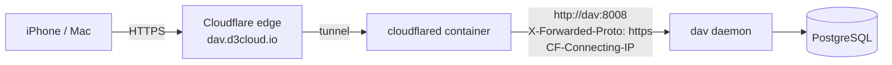

# Runbook: CalDAV and CardDAV (the `dav` daemon)

PST-T-8.2, PST-REQ-132 (CalDAV), PST-REQ-133 (CardDAV). Calendars and contacts for d3cloud.io
accounts, synced by iPhone/macOS Calendar and Contacts, DAVx5, Thunderbird — anything that speaks
RFC 4791 / RFC 6352 with RFC 6578 sync-collection. Hand-rolled: the XML parser and serializer are
`packages/dav-proto`, the server is `apps/dav`, iCalendar and vCard parsing are `packages/ical` and
`packages/vcard`.

## How it is wired



- TLS terminates at Cloudflare. The daemon speaks **plain HTTP on `LISTEN_PORT` (8008)**; nothing
  publishes that port, so only containers on the stack reach it.
- `X-Forwarded-Proto` and `CF-Connecting-IP` are believed **only from `DAV_TRUSTED_PROXIES`**
  (default: loopback and the private ranges a Docker network uses). From anyone else they are
  ignored.
- With `DAV_REQUIRE_HTTPS=true` (the default) a request with credentials is refused with 403 unless
  a trusted proxy says the client spoke HTTPS. The credentials are not even looked at: an app
  password must never be accepted after crossing a network in the clear.
- Health is on `HEALTH_PORT` (9105), like every daemon.

### Tunnel ingress

Postroom's tunnel is remotely managed (see `docker-compose.tunnel.yml`), so the ingress rule is
added in the Cloudflare dashboard, not in a file:

| Public hostname | Service |
|---|---|
| `dav.d3cloud.io` | `http://dav:8008` |

Put it **above** the catch-all rule. No Cloudflare Access policy on this hostname: CalDAV clients
cannot do an interactive login, and the daemon's own auth (below) is the gate. Leave "Disable
Chunked Encoding" off — iOS sends chunked PUTs.

For clients that ask DNS rather than following redirects (RFC 6764 §3), optionally publish:

```text
_caldavs._tcp.d3cloud.io.  SRV 0 1 443 dav.d3cloud.io.
_carddavs._tcp.d3cloud.io. SRV 0 1 443 dav.d3cloud.io.
_caldavs._tcp.d3cloud.io.  TXT "path=/dav/"
_carddavs._tcp.d3cloud.io. TXT "path=/dav/"
```

Verify with `dig @1.1.1.1 SRV _caldavs._tcp.d3cloud.io` — never the local resolver.

## Authentication

- HTTP Basic with an **app password that has the `dav` scope** (created on the web's App passwords
  screen). The account's web password is never accepted — `verifyProtocolLogin` does not look at it
  (PST-REQ-027).
- Every credential check runs through the shared tarpit and throttle, and every failure is an
  `auth.failure` audit row with `protocol: dav` (PST-REQ-075). The client address is
  `CF-Connecting-IP` from the tunnel, so one guesser does not lock everyone out.
- A successful verification is remembered for `DAV_AUTH_CACHE_MS` (5 minutes) under an HMAC of the
  credentials, because HTTP sends them on every request and iOS makes dozens per sync. Each
  remembered request still re-reads the app password row, so **a revocation or a disabled account
  takes effect on the very next request**.
- An account only ever sees its own tree; another account's paths are 404.

## URL space

| Path | What |
|---|---|
| `/.well-known/caldav`, `/.well-known/carddav` | 301 → `/dav/` |
| `/dav/` (and `/`) | answers `current-user-principal` |
| `/dav/principals/<account-id>/` | the principal: `calendar-home-set`, `addressbook-home-set`, `calendar-user-address-set` |
| `/dav/calendars/<account-id>/<calendar>/<object>.ics` | calendars and events/to-dos |
| `/dav/addressbooks/<account-id>/<book>/<card>.vcf` | address books and contacts |

Every person account has a **Calendar** (`calendar`, VEVENT + VTODO) and a **Contacts**
(`contacts`) collection from the moment it exists — a trigger on `account` in migration
`20260926085534_dav`, which also backfilled older accounts. Clients may add more (MKCALENDAR,
extended MKCOL), up to `DAV_MAX_COLLECTIONS` (64) per account.

## Client setup

**iPhone / iPad** — Settings → Calendar → Accounts → Add Account → Other → *Add CalDAV Account*:
server `dav.d3cloud.io`, user name your address (`you@d3cloud.io`), password an app password with
the `dav` scope. Contacts: the same under *Add CardDAV Account*. iOS finds the rest through
`/.well-known/caldav` and `/.well-known/carddav`.

**macOS** — Internet Accounts → Add Other Account → CalDAV account (Account type: Manual, server
`dav.d3cloud.io`); likewise a CardDAV account.

**DAVx5 / Thunderbird** — base URL `https://dav.d3cloud.io/dav/`.

## What is implemented

- WebDAV: OPTIONS (`DAV: 1, 3, extended-mkcol, calendar-access, addressbook`), PROPFIND Depth 0/1
  (Depth: infinity and a missing Depth get 403 `propfind-finite-depth`), PROPPATCH (displayname,
  calendar/addressbook-description, Apple's calendar-color and calendar-order; anything unknown is
  kept as a bounded dead property), MKCALENDAR, extended MKCOL, DELETE, GET/HEAD/PUT with strong
  ETags and If-Match / If-None-Match (412).
- CalDAV: calendar-query (comp-filter, time-range through recurrence with `expandCalendar`,
  prop-filter, param-filter, text-match, is-not-defined), calendar-multiget,
  supported-calendar-component-set, `no-uid-conflict`, `valid-calendar-object-resource`,
  max-resource-size.
- CardDAV: addressbook-query (anyof/allof, match types, limit), addressbook-multiget, vCard 3.0 and
  4.0, `no-uid-conflict`.
- sync-collection (RFC 6578): initial and incremental sync, removed members as a bare 404, invalid
  or foreign tokens 403 `valid-sync-token`, `limit` honoured with a 507 marker. CalendarServer's
  `getctag` equals the sync token.

Not implemented (and not advertised): locking (DAV class 2), MOVE/COPY, ACL, scheduling
(RFC 6638 — iOS then handles invitations itself), `expand`/partial `calendar-data`,
`expand-property`, principal search, sharing.

## Storage

Resources are stored **byte for byte as the client sent them**, encrypted: a fresh DEK per write
(AES-256-GCM), wrapped by the KEK (`POSTROOM_KEK`), both in the `dav_resource` row with the row id
as associated data. Deleting a row crypto-shreds it. Audit rows name the collection, resource,
etag and size — never the event or contact itself.

`dav_change` keeps every member change, tombstones included, so any earlier token still syncs
exactly. It is not pruned yet; at personal scale it stays small.

## Limits (env)

| Variable | Default | Meaning |
|---|---|---|
| `DAV_MAX_XML_BYTES` | 1 MiB | PROPFIND/REPORT/PROPPATCH bodies; over it: 413 |
| `DAV_MAX_RESOURCE_BYTES` | 4 MiB | one .ics or .vcf; over it: 403 `max-resource-size` |
| `DAV_MAX_COLLECTIONS` | 64 | calendars + address books per account; over it: 507 |
| `DAV_MAX_RESOURCES` | 50 000 | objects per collection; over it: 507 |
| `DAV_AUTH_CACHE_MS` | 300 000 | how long a verified app password is remembered |

Bodies are read as a stream and refused the moment they pass their cap; compressed request bodies
get 415.

## Troubleshooting

- **iOS says "Cannot connect using SSL"** — the tunnel is not routing `dav.d3cloud.io`, or the
  hostname has an Access policy. `curl -si https://dav.d3cloud.io/.well-known/caldav` should give
  `301` with `Location: /dav/`.
- **403 "DAV requires HTTPS" in the daemon's answers** — the request did not come through a trusted
  proxy, or cloudflared's address is outside `DAV_TRUSTED_PROXIES`. Check `docker network inspect`
  for the cloudflared container's address.
- **Every login 401s** — the app password lacks the `dav` scope, or `PASSWORD_PEPPER` differs from
  the api's. `auth.failure` rows carry the reason (`wrong_scope`, `bad_password`, …).
- **429 "too many failed logins"** — the source passed the throttle's ceiling; it clears as the
  window (15 minutes) moves on.
