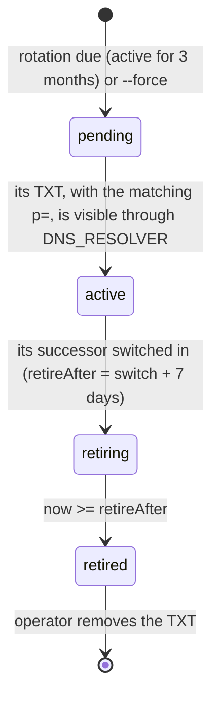

# DKIM key rotation

PST-T-7.4; PST-REQ-125 (building on PST-REQ-038).

Every sending domain signs each message twice, Ed25519 and RSA-2048. Each key is rotated
**quarterly**, under a **dated selector**, and the new key is **published before it signs**: the old
key keeps signing until our resolver sees the new TXT record, and stays published for **7 days**
after the switch so that mail signed just before it still verifies wherever it is delivered late.
Postroom never edits DNS — you publish and remove TXT records in Cloudflare; Postroom checks them.

## Selectors

`pr<yyyy><mm><a>` — `pr`, the UTC year and month the key was created, and `e` (Ed25519) or `r`
(RSA): `pr202610e`, `pr202610r`. A second key created in the same month gets a counter
(`pr202610e2`). A selector is never reused. The record lives at `<selector>._domainkey.<domain>`.

## States



| State | Signs? | What you do with its TXT |
|-------|--------|--------------------------|
| `pending` | no | publish it |
| `active` | yes (exactly one per algorithm) | keep it |
| `retiring` | no | keep it until at least `retireAfter` |
| `retired` | no | remove it |

Ed25519 and RSA switch independently: if only one record is visible, only that algorithm switches.
Every transition is written to the audit log as the system (`dkim_key.create`, `dkim_key.activate`,
`dkim_key.retiring`, `dkim_key.retire`).

## Schedule

Run one rotation pass per domain **daily**, as a Shipyard schedule on the submission image:

```bash
node dist/cli/dkim-keys.js rotate d3cloud.io
```

It needs `DATABASE_URL`, `POSTROOM_KEK` and `DNS_RESOLVER` (our validating resolver, `unbound:53` in
compose; default `127.0.0.1:53`). A pass is idempotent — it does nothing until something is due —
and prints one line per algorithm:

```
not-due         ed25519-sha256 pr202607e signs until rotation is due at 2026-10-05T09:00:00.000Z
created-pending ed25519-sha256 publish the TXT at pr202610e._domainkey.d3cloud.io; pr202607e keeps signing until it is visible
  publish: pr202610e._domainkey.d3cloud.io. IN TXT "v=DKIM1; k=ed25519; p=…"
awaiting-dns    rsa-sha256 no TXT record at pr202610r._domainkey.d3cloud.io yet; still signing with pr202607r
switched        ed25519-sha256 now signing with pr202610e; pr202607e retiring, keep its TXT published until at least 2026-10-13T09:00:00.000Z
retired         ed25519-sha256 retired pr202607e: the TXT at pr202607e._domainkey.d3cloud.io may now be removed
  may remove: pr202607e._domainkey.d3cloud.io. TXT
```

## When a rotation starts

1. The daily pass prints `created-pending` with two TXT records. Add both in Cloudflare (a TXT
   value over 255 octets is split into several quoted strings; Cloudflare does this for you).
2. Check them from outside: `dig +short TXT pr202610e._domainkey.d3cloud.io @1.1.1.1` (not the Mac's
   local resolver, which has returned empty TXT answers).
3. The next pass after our resolver sees them prints `switched`. Until then it prints
   `awaiting-dns` with the reason — including "does not carry this key's p= value" if the record
   was pasted wrong. Mail keeps going out signed with the old keys the whole time.
4. Seven days after the switch a pass prints `retired`. Remove those TXT records — not before.

`dkim-keys status <domain>` lists every key, its state and what to do with its record, at any time.

## Rotating early

`dkim-keys rotate <domain> --force` creates the pending successors now instead of at the quarter.
It never skips the DNS check or the 7-day overlap. (A compromised key needs more than this: rotate
with `--force`, then replace its TXT with `v=DKIM1; p=` to revoke it, accepting that mail it signed
stops verifying.)

## Related

PST-REQ-125, PST-REQ-038, PST-T-7.4. Code: `apps/submission/src/dkim-rotation.ts`,
`apps/submission/src/cli/dkim-keys.ts`. The fixture that proves no signature is left unverifiable:
`apps/submission/test/integration/dkim-rotation.test.ts`.
