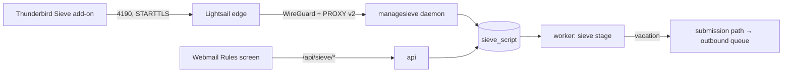

# Runbook: Sieve rules — ManageSieve, the rules builder, and the sieve stage

PST-T-9.5: PST-REQ-149 (ManageSieve on 4190), PST-REQ-150 (the webmail rules builder) and
PST-REQ-148 (scripts run on inbound mail). The interpreter is `packages/sieve`, the protocol daemon
and the script store are `apps/managesieve`, the webmail's routes are `apps/api/src/sieve`, the
screen is `apps/web/src/screens/Rules.tsx`, and scripts run in the worker's `sieve` stage
(`apps/worker/src/stages/sieve.ts`, carried out by `file.ts`).

## How it is wired



- One script store, two doors. ManageSieve and the webmail both write through
  `@postroom/managesieve/store`: a script is stored only if it compiles (the refusal names the line
  and column), one script per account is active (a partial unique index backs it up), the active
  script cannot be deleted, and every write is an audit row (`sieve.script.put`, `.activate`,
  `.deactivate`, `.rename`, `.delete`; the webmail's Check is `sieve.script.check`).
- Limits: a script is at most 256 KiB, an account has at most 32, a name is 1–128 characters without
  control characters.

## The daemon

- `postroom managesieve`, in the wireguard sidecar's network namespace like the other protocol
  daemons. It listens on `MANAGESIEVE_PORT` (4190), plaintext with **STARTTLS** — RFC 5804 has no
  implicit-TLS port. Health is on `HEALTH_PORT` (9107); the admin Health screen reaches it at
  `http://wireguard:9107/health` (`DAEMON_HEALTH_URLS`).
- **Only after STARTTLS** is `SASL "PLAIN"` advertised; before it the list is empty and
  `AUTHENTICATE` answers `NO (ENCRYPT-NEEDED)`. Without `TLS_CERT_FILE`/`TLS_KEY_FILE` there is no
  STARTTLS at all, so nothing can log in, and `/health` says `degraded`.
- **App passwords with the `sieve` scope only** ("Filters (ManageSieve)" on the App passwords
  screen). The account password is never accepted; an `imap`-only app password is refused too.
- Every credential check goes through the shared throttle (protocol `managesieve`): a tarpit before
  the password is looked at, a refusal (`NO (TRYLATER)`) past the source ceiling, and each failure an
  `auth.failure` audit row. Three failures in one connection end it.
- **PROXY v2 only from the edge's WireGuard peer** (`EDGE_PEER_ADDRESS`), and required from it; a
  PROXY header from anyone else closes the connection. The audit rows carry the real client address.
- Strict CRLF: a bare LF or CR in a command line is answered `NO` and the line is dropped. Literals
  may be `{n+}` or `{n}` (both non-synchronising). A literal over the size limit is read and
  discarded and answered `NO (QUOTA/MAXSIZE)`; one over 16 MiB ends the connection.
- `MANAGESIEVE_MAX_CONNECTIONS_PER_IP` (10), `MANAGESIEVE_PREAUTH_TIMEOUT_MS` (60 s),
  `MANAGESIEVE_IDLE_TIMEOUT_MS` (30 min).
- The imap daemon still has an old placeholder listener that reads the same `MANAGESIEVE_PORT`;
  compose gives imap `MANAGESIEVE_PORT: "0"` so it binds a throwaway port and never takes 4190.

### Connecting Thunderbird

1. Create an app password with **Filters (ManageSieve)** on the App passwords screen.
2. In the Sieve add-on: server `mail.d3cloud.io` (whatever the edge is published as), port 4190,
   security **STARTTLS**, username the full address, password the app password.
3. Open the script list, edit, save, and activate. The integration test
   `apps/managesieve/test/integration/managesieve.test.ts` replays exactly this sequence.

Check from a shell:

```bash
openssl s_client -starttls sieve -connect mail.d3cloud.io:4190 -quiet
# then: AUTHENTICATE "PLAIN" "<base64 of \0user@d3cloud.io\0app-password>"
#       LISTSCRIPTS
```

## The rules builder

Account → Rules in the webmail. Rows ("if From/To/Subject/List-Id contains/is …, then move to folder /
sort into bucket / flag / mark as read") compile to a script named **Postroom rules**, in one fixed
shape that reads back into the same rows. A script in any other shape — written by hand, or in
Thunderbird — opens in the **Edit as Sieve** view instead of being half-read into rows. **Check**
compiles without saving; a compile error is shown with its line and column. Rules run top to bottom:
put flag and mark-as-read rules above a move rule if the moved copy should carry the flag.

## What a script does to a message

The sieve stage runs each recipient account's active script (after `classify`, before `file`) and
records per account: the deliveries, discard, redirects, bucket, vacation, any runtime error, and a
bounded trace — all in the stage's marker, with reasons on every filed copy's verdict.

| Script | What happens |
|---|---|
| `keep`, or no action (implicit keep) | Filed where the classifier decided (INBOX with $Priority/$People, or a bucket folder) |
| `fileinto "X"` | Filed into X if it exists; with `:create`, created. A missing X without `:create` is kept instead, and the verdict says why |
| `addflag`/`setflag` (imap4flags) | The flags go on the copy. `\Seen \Answered \Flagged \Deleted \Draft` and valid keywords only; anything else is left off with a reason |
| `bucket "newsletters"` (vnd.postroom.bucket) | Overrides the classifier's bucket for a keep. A name that is not a sorting bucket files into a folder of that name |
| `discard` | **Filed to Trash with the reason**, never deleted: Postroom does no silent deletion. Trash's retention clock then applies |
| `redirect "a@b"` | Only to an address the account itself owns (primary, masked, service), and then it is delivered to the account's own INBOX. Anything else is refused with the reason and the message is kept. **Postroom never relays** (PST-REQ-053) |
| `vacation` | See below |
| A runtime error | The implicit keep, with the error on the verdict |

### Vacation replies

- RFC 5230 rules, in the interpreter: no reply to a null or automated sender (`MAILER-DAEMON`,
  `owner-*`, `*-request`, `noreply` …), to `Auto-Submitted` mail, to `List-*` or `Precedence:
  bulk/list/junk` mail, to mail not addressed to one of the account's addresses, or to a sender
  already answered with the same handle within `:days` (1–30, default 7).
- Added by the stage: no reply to mail the classifier put in Junk or smtp-in quarantined (no
  backscatter), and at most `SIEVE_VACATION_DAILY_CAP` (200) replies per account per 24 hours.
- The reply goes through the **submission path**: From must be one of the account's own addresses,
  it is DKIM-signed (no DKIM keys for the domain → not sent, and the reason says so), queued and
  audited (`submission.accept`, `submitted_via = 'sieve-vacation'`). The envelope sender is the null
  path, and the reply carries `Auto-Submitted: auto-replied`, `In-Reply-To` and `References`.
- Exactly once: the `sieve_vacation_reply` row is written in the same transaction that queues the
  reply, unique per (account, inbound message). Replaying the sieve stage re-runs the script and
  sends nothing new; the store of those rows is the `:days` memory.
- The worker needs `POSTROOM_KEK` to sign; without it replies are recorded as not sent.

## When something is wrong

- **"Authentication failed" from Thunderbird**: the app password lacks the `sieve` scope, or it is the
  account password. Look for `auth.failure` rows with `"protocol":"managesieve"` in the audit log.
- **`NO (TRYLATER)`**: the throttle is refusing that source; it clears as failures age out of the
  window (15 minutes).
- **A message went somewhere unexpected**: the copy's verdict reasons name the script, the line, and
  what it decided; the sieve stage's marker (Inspect drawer / `verdicts.pipeline.stages.sieve`) holds
  the full outcome and trace. Replaying from the `sieve` stage re-runs the current active script
  (the file stage files nothing new for a message already filed).
- **Turn every script off**: the Rules screen's "Turn rules off", or `SETACTIVE ""` over ManageSieve.
